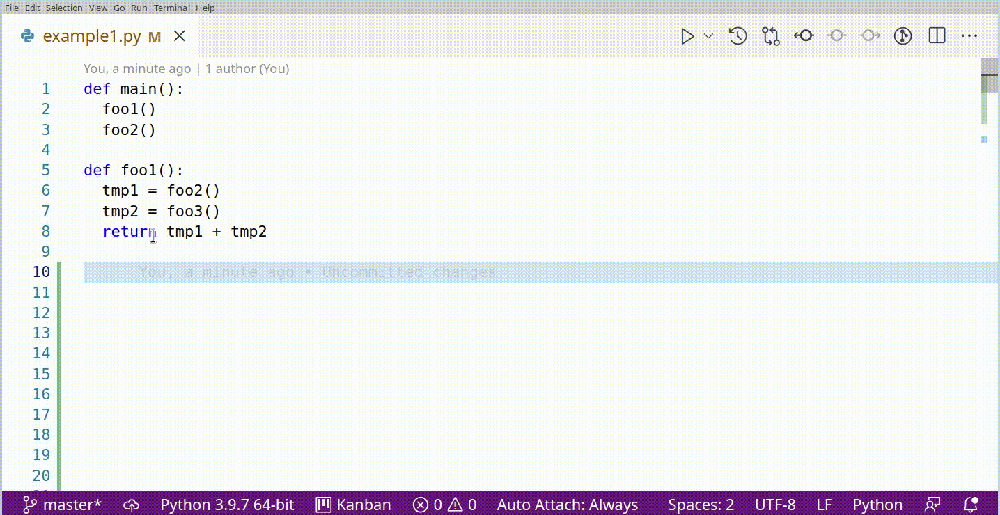
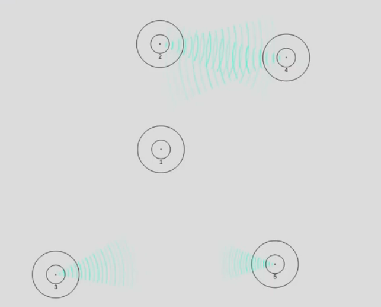

<link type='text/css' href='styles.css'  rel='stylesheet'>

* TOC
{:toc}

# What is this?
This is my desperate search of company :)

  You are a programmer dreaming about how to change the world,
  how to improve all these bad-interfaced and not working applications, but you're missing time and wo:manpower?

  Well, me too. Maybe some of your ideas and my ideas align. If you're seriously interested in any of the ideas below, feel free to contact me (directly or per [issue tracker](https://github.com/DarkTrick/darktrick.github.io/issues).

  [View on Github](https://github.com/DarkTrick/darktrick.github.io)

**What about this stupid name?** 
Historical name. Wouldn't choose the same one again if I would.

# Bigger projects

## Programming: Source Code Visualizer
[Project started](https://github.com/DarkTrick/SourceCodeVisualizer)

**Background**  
Why is source code written in text on a one-dimensional sheet of paper? I think functions and classes should be represented as interconnected boxes to reduce the cognitive burden on programmers.

## Language Teaching: Free, Open (Immersive) Learning Environment

**Goal** 
Every native speaker should be able to be a teacher. The goal is to create a fully-fledged out teaching plan with all necessary material to teach a given language to beginners and intermediates.

**Constraints** 

- All material is free to use.
- The material is among the top 3 in web searches.

**Why?** 
It's 2022 and it's still a chore to find teaching plans for languages. Mostly you need to create your own teaching plan from very expensive material/books. This is even true for

This is a problem, because it slows down the ability for intercultural communication, extremely.

I'm not a bible guy, but doesn't it say that god said if all people could speak the same language, they could accomplish everything? (which was the initial reason to sabotage humanity). Being biblical or not, I think this has some true insight (Even, if it may not necessarily be constrained to *language* only).

## Language Learning: Free, Open (Immersive) Learning Environment

**Goal** 
Basically, create a clone of RosettaStone, that is free to use and works without flaws.

**Why?** 
Material-wise, RosettaStone is very, very good. Clear sounds, mostly clear pictures. But interface / UX-wise it ... sucks hoop. Biggest problems are synchronization bugs, data loading time, forced waiting times and a company that believes in *every bug is a feature*.

Why not Duolingo? Because they have

**Constraints**

- It must be good! There a gazillions of trash products out there (paid and unpaid). Developers adding google translate voices to their audible vocab trainer and seriously believe they did something good.
- It must be among the top 5 on google.

## Application Software: Free & Working Presentation Software
**Goal**:  
Create a free, open source, *simply working* **replacement** for Libre Impress.

**Why?**  
Because the free open source world needs a proper presentation software (which Libre Impress is not, btw.).

**Some Features** 
- Slides should be creatable in a tree structure. This would generalize the *masterslide concept*
- I think Powerpoint provides a very good UX. Workflow (clicking, moving, dragging, ...) is very, very smooth.
- Landscape feature would be nice (like in *Prezi*), where you can move and zoom within a single slide.

<iframe width="560" height="315" src="https://www.youtube.com/embed/IHW0W4JXrF4" title="YouTube video player" frameborder="0" allow="accelerometer; autoplay; clipboard-write; encrypted-media; gyroscope; picture-in-picture" allowfullscreen></iframe>

**Currently facing problems** 
This project would need quite a couple of people working on it. I don't know these people.

# Programming

## Automated Testing Advanced Topics
[Project started](https://github.com/DarkTrick/Automated-Testing-Advanced-Topics)

## Git: `Gitp`: Tool to Improve Git UX
[Project started](https://github.com/DarkTrick/gitp)

**Goal** 
Provide a tool with improved UX compared to git (especially for newcomers).

**Why** 
Sometimes git feels like perl: Some very simple actions require a google search to figure out, while the necessary commands are so difficult, you'll need a google search next time as well.

Example: Instead of `git push origin -d mybranch`, it should be `git branch delete remote`.

`
.
# Application Software

## Spatial Sound for Online Meetings

<iframe width="560" height="315" src="https://www.youtube.com/embed/fVDzJ-Oed3w" title="YouTube video player" frameborder="0" allow="accelerometer; autoplay; clipboard-write; encrypted-media; gyroscope; picture-in-picture" allowfullscreen></iframe>

## RPG-skill map as Professional Project organization tool

<iframe width="560" height="315" src="https://www.youtube.com/embed/qfOddbwtoOk" title="YouTube video player" frameborder="0" allow="accelerometer; autoplay; clipboard-write; encrypted-media; gyroscope; picture-in-picture" allowfullscreen></iframe>

## Create free, standard MS Paint clone
**Goal**  
Create a free, open source, *simply working*, smooth working, MS Paint clone as provided in Win 7 / 10.

**Why?**  
There is no standard alternative to MS Paint, which offers a very good balance between *just playing around* and *a little bit more*.

Yes, there are some alternative, but they are not free, not smooth (Hello PaintX), don't provide action icons (Hello KolourPaint :) ) or try to be more or less in a bad way.

## Create free, Windows Explorer Clone

**Goal** 
Create a windows explorer clone that works on linux and possibly on Mac.

**Why** 
Every file explorer for Linux or Mac is like hell for every general-purpose PC user. Some try to be extra-nice (hello Dolphin), Some are rather clean, but there was a UI/UX expert missing (hello Thunar), some I don't undersand (hello nautilus), and Mac's Finder is worse than MS Bob.

# Free Software World

## GTK: Gtk3 Tutorial
[**Project started**](https://github.com/DarkTrick/gtk3_examples)
(currently in bad condition)

**Goal** 
Provide up-to-date tutorials for GTK3

**Why** 
1. There are almost no up-to-date tutorials for GTK3 available. There is almost no support available. The path to writing GTK3 software is covert with brick walls.
2. A *HUGE* amount of software is written in GTK3. Maintaining or porting to GTK4 requires appropriate knowledge.

## GTK: Create better file dialog
Current GTK file dialog is ... improvable.
## GTK: Create better font selection dialog
Current GTK font selection dialog is ... unusable (always freezes)
## GTK: Create better color selection dialog

## CUI Tool mapper
[Project started under GitP development](https://github.com/DarkTrick/gitp)

A library/tool, that can be used to map CUI program commands to something more understandable. This is basically a product of a clean implementation of [GitP](https://github.com/DarkTrick/gitp)

# Other

## Webserver Remote Desktop Tool for eReader
[Project started](https://github.com/DarkTrick/kindle_eMonitor)
**Goal** 
Provide a webserver-based Remote desktop tool for e-readers with integrated web browser. Client (eReader) can perfom simple remote control tasks.

**Why** 
Because eReaders are out since 2010 and we can still not read wikipedia easily on an eReader - good on the eyes.

**Features** 
- Super easy interface.
- While running, over-Screen interface (no dedicated window).
- Shared area is easily changable via border drag-and-drop
- Swipe-actions on e-reader result in scrolling the webpage on screen

