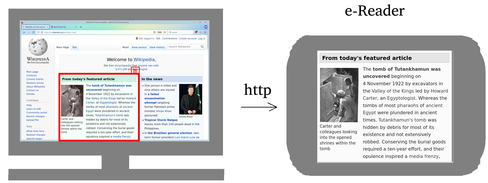

<link type='text/css' href='styles.css'  rel='stylesheet'>

**What about this stupid name?** 
Historical name. Wouldn't choose the same one again if I would.

# Bigger projects

## Source Code Visualizer
[Project started](https://github.com/DarkTrick/SourceCodeVisualizer)

**Background**  
Why is source code written in text on a one-dimensional sheet of paper? I think functions and classes should be represented as interconnected boxes to reduce the cognitive burden on programmers.

## Free & Working Presentation Software
**Goal**:  
Create a free, open source, *simply working* **replacement** for Libre Impress.

**Why?**  
Because the free open source world needs a proper presentation software (which Libre Impress is not, btw.).

**Some Features** 
- Slides should be creatable in a tree structure. This would generalize the *masterslide concept*
- I think Powerpoint provides a very good UX. Workflow (clicking, moving, dragging, ...) is very, very smooth.
- Landscape feature would be nice (like in *Prezi*), where you can move and zoom within a single slide.

**Currently facing problems** 
This project would need quite a couple of people working on it. I don't know these people.

# Programming

## Automated Testing Advanced Topics
[Project started](https://github.com/DarkTrick/Automated-Testing-Advanced-Topics)

## Git
### Gitp: Tool to Improve Git UX
[Project started](https://github.com/DarkTrick/gitp)

**Goal** 
Provide a tool with improved UX compared to git (especially for newcomers).

**Why** 
Sometimes git feels like perl: Some very simple actions require a google search to figure out, while the necessary commands are so difficult, you'll need a google search next time as well.

Example: Instead of `git push origin -d mybranch`, it should be `git branch delete remote`.

`
.
# Application Software

## Create free, standard MS Paint clone
**Goal**  
Create a free, open source, *simply working*, smooth working, MS Paint clone as provided in Win 7 / 10.

**Why?**  
There is no standard alternative to MS Paint, which offers a very good balance between *just playing around* and *a little bit more*.

Yes, there are some alternative, but they are not free, not smooth (Hello PaintX), don't provide action icons (Hello KolourPaint :) ) or try to be more or less in a bad way.

## Create free, Windows Explorer Clone

**Goal** 
Create a windows explorer clone that works on linux and possibly on Mac.

**Why** 
Every file explorer for Linux or Mac is like hell for every general-purpose PC user. Some try to be extra-nice (hello Dolphin), Some are rather clean, but there was a UI/UX expert missing (hello Thunar), some I don't undersand (hello nautilus), and Mac's Finder is worse than MS Bob.

# Free Software World

## GTK

### Gtk3 Tutorial
[**Project started**](https://github.com/DarkTrick/gtk3_examples)
(currently in bad condition)

**Goal** 
Provide up-to-date tutorials for GTK3

**Why** 
1. There are almost no up-to-date tutorials for GTK3 available. There is almost no support available. The path to writing GTK3 software is covert with brick walls.
2. A *HUGE* amount of software is written in GTK3. Maintaining or porting to GTK4 requires appropriate knowledge.

### Create better file dialog
Current GTK file dialog is ... improvable.
### Create better font selection dialog
Current GTK font selection dialog is ... unusable (always freezes)
### Create better color selection dialog

## CUI Tool mapper
[Project started under GitP development](https://github.com/DarkTrick/gitp)

A library/tool, that can be used to map CUI program commands to something more understandable. This is basically a product of a clean implementation of [GitP](https://github.com/DarkTrick/gitp)

# Other

## Webserver Remote Desktop Tool for eReader
[Project started](https://github.com/DarkTrick/kindle_eMonitor)
**Goal** 
Provide a webserver-based Remote desktop tool for e-readers with integrated web browser. Client (eReader) can perfom simple remote control tasks.

**Why** 
Because eReaders are out since 2010 and we can still not read wikipedia easily on an eReader - good on the eyes.

**Features** 
- Super easy interface.
- While running, over-Screen interface (no dedicated window).
- Shared area is easily changable via border drag-and-drop
- Swipe-actions on e-reader result in scrolling the webpage on screen

